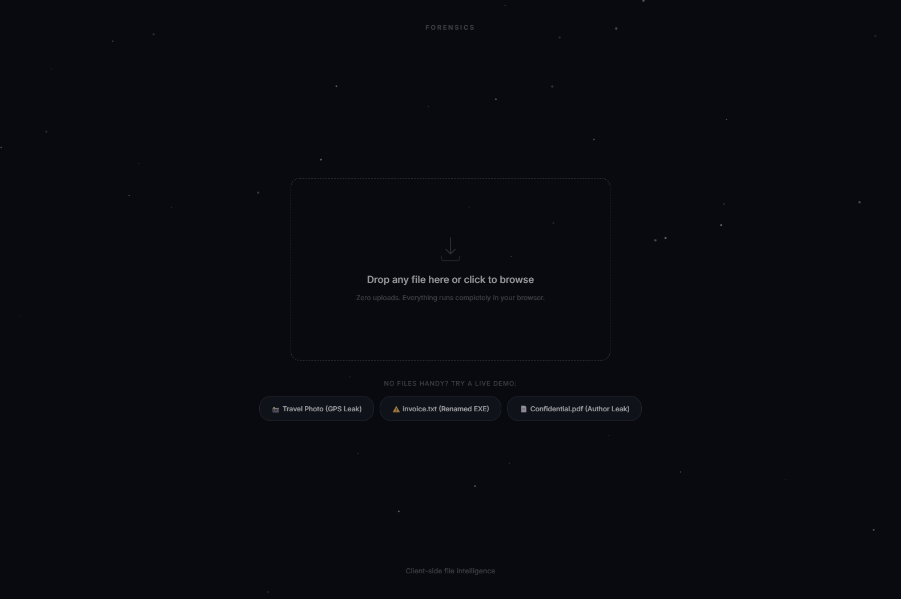

# Forensics

**See what your files are hiding.** Drop any file to instantly expose hidden EXIF metadata, GPS leaks, true file type, byte-level entropy, embedded strings, and steganography — a full forensic report in milliseconds. Zero uploads, zero dependencies, everything runs in your browser.




---

## Why

Every file carries silent data. A vacation photo embeds the GPS coordinates of your house, a PDF leaks the author's full name and OS version, and a renamed executable slips past anyone who trusts the file extension. Inspecting this usually means uploading to an online checker (compromising the very privacy you're trying to protect) or installing heavyweight CLI tools like ExifTool.

**Forensics** does it in the browser. Nothing is uploaded. Nothing is installed. Drop a file and get a full forensic breakdown before you can blink.

---

## Features

| Capability | What it does |
|---|---|
| **Hand-rolled EXIF/TIFF parser** | Walks JPEG APP1 and PNG eXIf segments — decodes IFD directories, endianness, GPS rational pairs, camera make/model, lens, software, and timestamps. No library involved. |
| **GPS location mapping** | Extracts embedded coordinates and plots them on a hand-rolled canvas slippy map with OSM tiles, dark-mode filter, animated crosshair overlay, pulsing range rings, and radar sweep. Privacy-first: tiles load only after explicit opt-in. |
| **Magic-byte file identification** | Matches the first 4–16 bytes against 30+ known signatures. Flags extension mismatches — catches a `.txt` that's actually an `.exe`. |
| **Shannon entropy analysis** | Computes bits-per-byte across the full file and renders a 256-bar canvas frequency chart. Near 0 = structured text, near 8 = encrypted or compressed. |
| **Steganography detection** | Scans past the official EOF marker (JPEG `FFD9`, PNG `IEND`) to find appended hidden payloads. |
| **PDF metadata extraction** | Pulls author, title, creator, producer, dates, page count, and flags embedded JavaScript. |
| **ASCII strings extractor** | Scans raw bytes for printable runs and flags URLs, email addresses, file paths, and credential-like patterns. |
| **Risk verdict engine** | Synthesizes all findings into a Clear / Caution / Exposed verdict with specific, plain-English explanations. |
| **JSON report export** | One-click download of the full structured forensic report, or copy to clipboard. |
| **Image preview** | Canvas-rendered thumbnail with resolution and color-depth stats for supported image formats. |
| **Sound feedback** | Web Audio API chime synthesis for scan progress, warnings, and completion. |
| **5 instant demos** | GPS photo, disguised executable, leaky PDF, hidden payload, and clean image — try everything without a file on hand. |

---

## Architecture

```
┌─────────────────┐         ┌─────────────────┐         ┌─────────────────┐
│   FILE INPUT    │         │    ANALYSIS      │         │   RENDERING     │
│                 │         │                  │         │                 │
│ Drag & Drop     │────────►│ Magic-byte ID    │────────►│ Verdict card    │
│ File picker     │ Array   │ EXIF/TIFF parser │ parsed  │ Stats grid      │
│ Demo generators │ Buffer  │ PDF metadata     │  data   │ Canvas entropy  │
│                 │         │ Shannon H(X)     │         │ Canvas map      │
│                 │         │ EOF stego scan   │         │ Strings table   │
│                 │         │ String extractor  │         │ JSON export     │
│                 │         │ Verdict engine   │         │ Image preview   │
└─────────────────┘         └─────────────────┘         └─────────────────┘

                    ⬤ Entirely client-side — zero uploads, zero servers
```

### Data flow

```
File dropped / demo clicked
  ↓
ArrayBuffer loaded ────────────── FileReader API
  ↓
True type identified ──────────── magic-byte comparison (30+ signatures)
  ↓
EXIF/TIFF parsed ──────────────── binary IFD traversal, GPS rational decode
  ↓
PDF metadata extracted ────────── text-based /Info dictionary parser
  ↓
Entropy computed ──────────────── 256-bin byte frequency → Shannon formula
  ↓
Strings extracted ─────────────── printable ASCII scan → URL/email/cred flagging
  ↓
Steganography checked ─────────── EOF marker offset vs total file size
  ↓
Verdict synthesized ───────────── all findings → risk level + explanations
  ↓
Report rendered ───────────────── cards, charts, map, export

Total: ~200ms from drop to full report
```

The EXIF parser determines byte order from the TIFF header (`II` or `MM`), walks IFD entry chains, and maps tag IDs to human-readable fields. GPS coordinates are decoded from rational number triples (degrees/minutes/seconds) into decimal degrees. Entropy uses Shannon's formula — values near 0 indicate structured data, values near 8 indicate encrypted or compressed content.

---

## Tech stack

**Zero runtime dependencies.** Everything is hand-rolled vanilla JavaScript:

- Binary parsing via `ArrayBuffer` + `DataView`
- Canvas rendering for entropy chart, image preview, and slippy map
- CSS-only card entrance animations (no animation library)
- Web Audio API for synthesized sound feedback
- System font stack (no external font loading)
- CSP headers lock the page to its own origin (only exception: optional OSM map tiles)

---

## Quick start

```bash
git clone https://github.com/shreyasfegade/forensics.git
cd forensics
npx serve
```

Open [http://localhost:3000](http://localhost:3000). That's it — no install, no build step.

Or deploy to Vercel: import the repo and it works with zero configuration.

---

## Project structure

```
forensics/
├── css/
│   └── styles.css      # Layout, glassmorphism, card animations, responsive
├── js/
│   └── app.js          # All parsers, map, chart, tween engine, UI logic
├── index.html          # Markup — hero, drop zone, demos, results shell
├── vercel.json         # Zero-config deploy + CSP/security headers
├── package.json        # Metadata only — no runtime dependencies
├── screenshots/        # Portfolio screenshots
└── LICENSE             # MIT
```

---

## Limitations

- **Browser memory**: very large files (100MB+) may cause tab memory pressure since the full `ArrayBuffer` lives in RAM.
- **EXIF coverage**: optimized for JPEG and PNG. HEIF/HEIC and TIFF-container RAW formats are not yet supported.
- **No persistence**: analysis is ephemeral — results are lost on refresh (by design, for privacy).

---

## License

MIT — see [LICENSE](LICENSE).
