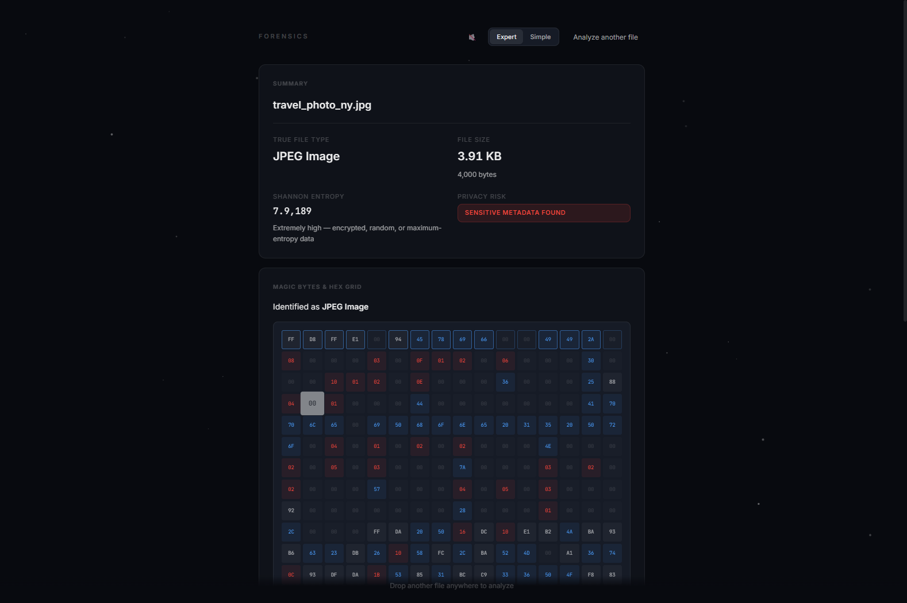

# Forensics

**Drop any file to instantly reveal hidden metadata, EXIF tags, GPS leaks, and steganography markers.** Zero uploads — everything runs locally in your browser.




---

## The Problem

Every digital asset carries silent data. A camera photo contains GPS coordinates of where it was shot, a document lists corporate authors and software version trees, and malicious binaries can mask themselves as harmless text files. Analyzing these files usually requires uploading them to online checkers (risking data privacy) or installing complex command-line utility suites (like ExifTool).

## The Solution

**Forensics** provides instant client-side file inspection. Utilizing the browser File API, `ArrayBuffer`, and direct `DataView` binary stream parsing, it decodes camera metadata, maps GPS offsets, computes Shannon entropy, and exposes hidden appended payloads—all running completely in sandboxed browser memory. No data ever leaves your computer.

---

## Features

- **Binary Signature Detector** — Scans the first 8-16 bytes (magic bytes) against a database of signatures to determine the true file type, warning of extension mismatches (e.g., an executable renamed to a `.txt` file).
- **Hand-Rolled EXIF Parser** — Recursively parses JPEG APP1 and PNG `eXIf` segments, decoding TIFF byte ordering (endianness), IFD pointers, and GPS rational numbers without external libraries.
- **GPS Mapping Layer** — Resolves coordinate data from EXIF properties and plots the exact photo location on a Leaflet-powered dark mode map.
- **Shannon Entropy Analysis** — Computes raw byte-frequency entropy across the file and renders a real-time, interactive 256-bar canvas chart.
- **Steganography Detector** — Scans for hidden bytes appended after the official End-of-File (EOF) marker (e.g., JPEG `0xFFD9`, PNG `IEND`).
- **Interactive Hex Grid** — Renders the first 256 bytes of any file as a color-coded hex cell matrix with ASCII characters and category hover highlights (Null, Control, ASCII, Other).
- **Sound Feedback Engine** — Integrates synthesized haptic chime sweeps using the Web Audio API to alert on analysis complete, warning, or reset.
- **Sandbox Demo Mode** — Built-in mock binary generators to demonstrate camera EXIF leaks, renamed executables, and confidential PDFs in one click.

---

## Tech Stack

- **HTML5 Canvas & Layout**: Clean, structured HTML structure with responsive Glassmorphic styling.
- **Interactions & Core Logic**: Pure vanilla ES6 JavaScript (hand-rolled binary parsing, array buffers, audio synthesis).
- **Animations**: GSAP (GreenSock Animation Platform) for smooth transitions and scan effects.
- **Map Renderer**: Leaflet.js (configured with an inverted dark tiles filter).
- **Build Tooling**: Zero-build. Server runs on any static file server (e.g., Node `http-server` or Python `http.server`).

---

## Quick Start

### Installation & Run

1. **Clone the repository:**
   ```bash
   git clone https://github.com/shreyasfegade/forensics.git
   cd forensics
   ```

2. **Launch a local server:**
   
   If you have Python installed:
   ```bash
   python -m http.server 3000
   ```
   
   Or if you have Node.js:
   ```bash
   npx http-server -p 3000
   ```

3. **Access the tool:**
   Open [http://localhost:3000](http://localhost:3000) in your browser.

---

## Project Structure

```text
forensics/
├── css/
│   └── styles.css        # Styles, animations, glassmorphism layout
├── js/
│   └── app.js            # Binary parsers, Web Audio synthesis, UI interactions
├── index.html            # Main markup and script imports
├── package.json          # Dependency configurations for development
├── LICENSE               # MIT License
├── .gitignore            # Git exclusions
└── screenshots/          # Portfolio screenshots
```

---

## Current Status

This project is a **fully functional client-side utility**.

- **Implemented**: True type checking, custom EXIF/TIFF parsing, PDF metadata extraction, Shannon entropy canvas drawing, steganography marker checks, hex grid visualization, audio feedback, and dark-mode mapping.
- **In Progress**: Local HEIF/HEIC metadata extraction support.
- **Planned**: Batch file analysis and exportable forensic reports (PDF format).

---

## Architecture

```
┌─────────────────┐         ┌─────────────────┐         ┌─────────────────┐
│   FILE INPUT    │         │    ANALYSIS     │         │   RENDERING     │
│                 │         │                 │         │                 │
│ • Drag & Drop   │────────►│ • True Type ID  │────────►│ • Results Grid  │
│ • FileReader    │  Array  │ • EXIF Parser   │ parsed  │ • Canvas Chart  │
│ • ArrayBuffer   │  Buffer │ • Shannon H(X)  │ data    │ • Hex Editor    │
│                 │         │ • EOF Stego     │         │ • Leaflet Map   │
└─────────────────┘         └─────────────────┘         └─────────────────┘

                        ⬤ Entirely client-side — zero uploads, zero servers
```

### Data Flow

```
1. File dropped onto page
   ↓
2. ArrayBuffer loaded ─────────────────── ~50ms (FileReader API)
   ↓
3. True type verified ─────────────────── ~5ms (magic byte comparison)
   ↓
4. EXIF/metadata parsed ───────────────── ~30ms (binary IFD traversal)
   ↓
5. Entropy computed ───────────────────── ~80ms (256-byte frequency distribution)
   ↓
6. Steganography checked ──────────────── ~20ms (EOF marker vs file size)
   ↓
7. Results rendered ───────────────────── ~15ms (grid + canvas + hex + map)

Total: ~200ms from drop to full forensic report
```

The EXIF parser walks TIFF IFD directories, determines byte order (Big/Little Endian), and maps tag IDs (`0x0110` for camera model, `0x8825` for GPS) to human-readable values. GPS coordinates are decoded from rational pairs into decimal degrees and plotted on a dark-themed Leaflet.js map.

Entropy is computed via Shannon's formula: values near 0 indicate structured data (text), values near 8 indicate high randomness (encrypted/compressed). Steganography detection compares the file's EOF marker offset to total file size — excess bytes indicate hidden payloads.

---

## Limitations

- **Browser Memory Boundaries**: Large files (>100MB) can cause tab memory pressure since files are buffered into browser RAM as `ArrayBuffer` objects.
- **Static Formats**: EXIF extraction is optimized for JPEG and PNG formats.
- **No Persistence**: Client-side execution means analysis history is lost on page refresh.

---

## What This Project Taught Me

- How binary file structures work: `ArrayBuffer`, `DataView`, endianness conversion, and TIFF directory layouts.
- How Shannon Entropy quantifies randomness in digital data and why it matters for security analysis.
- The Web Audio API for synthesizing custom audio tones and chime sequences.
- CSS filter compositing tricks for adapting open-source mapping libraries to dark themes.

## Development Note

**Built with AI-assisted development.** I directed the product vision, designed the analysis pipeline, and made the architecture decisions. AI tools accelerated the implementation.

My contributions:
- The core idea: a 100% private, zero-upload forensic analysis utility that runs entirely in the browser.
- Architecture: structuring the file split from a monolithic HTML file into modular CSS and JS modules.
- The glassmorphic design system and particle effects backdrop.
- Defining the analysis pipeline: what metadata to extract, how to visualize entropy, and steganography detection logic.

---

## License

This project is licensed under the MIT License - see the [LICENSE](LICENSE) file for details.
